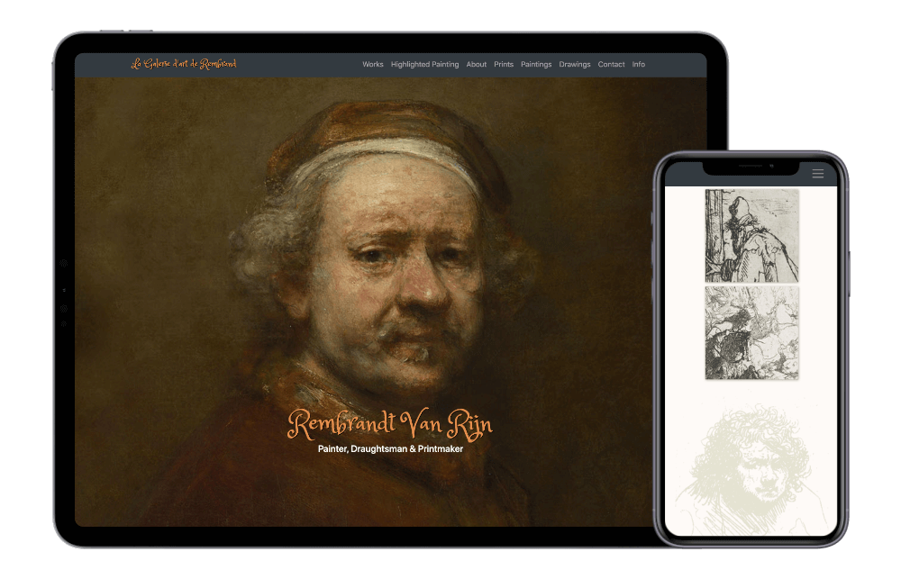

# Rembrandt-Van-Rijn 
It is a project from the course on Pluralsight ["Creating a Site with CSS Grid and Bootstrap 4".](https://app.pluralsight.com/library/courses/css-grid-bootstrap-4-creating-site/table-of-contents) 
    
 In this course, I learned how to apply Bootstrap 4 and CSS Grid 
 module to do designs that change with responsive breakpoints by 
 defining the relationship 
 of HTML elements in terms of size and position.

  

